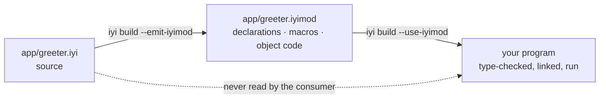

# iyi

[](https://github.com/sdogruyol/iyi/actions/workflows/iyi.yml)
[](LICENSE)

**A language built for Developer & Agentic Experience, Portability, Performance,
and Efficiency.** (*iyi* is Turkish for "good".)

Those four are one design decision seen from four sides. A module is the unit of
compilation and it is compiled against its dependencies' **declarations**, never
their bodies — so a build reads less, a program carries less, a tool can read an
interface without a repository, and a person waits less. Everything below is
that rule and what it costs.

| | measured today |
|---|---|
| **Developer experience** | edit one module in a 7,208-line project and rebuild: **0.13 s**, against Crystal's 1.17 s and `go build`'s 0.16 s |
| **Agentic experience** | a module's interface is a file, not a convention: `iyi mod dump` prints it, and a consumer type-checks against it with the source deleted |
| **Portability** | an iyi program compiles for **eight targets**, from `aarch64-darwin` to `x86_64-windows-msvc`. Only Linux x86-64 is tested end to end |
| **Performance** | native code through LLVM, and a front end that answers `hello` in **0.031 s**. At run time the two libraries are within noise where they do the same work |
| **Efficiency** | that `hello` is a **17 KB** binary that starts in **1.2 ms**; the same program with Crystal's library is 972 KB and 3.4 ms |

iyi is a fork of [Crystal](https://crystal-lang.org) and says so in its licence,
its NOTICE and its version line. What it is not is a dialect: the rules below
are the language, and they are what Crystal does not have.

Here is the program the numbers below are about. One script writes it three
times, in iyi, in Crystal and in Go, from the same set of numbers:

* **30 modules**, one file each, 10 types per module: 300 types, **7,208
  lines**.
* **one `main`** that calls a function in all thirty modules, adds up what they
  answer, and prints the total.
* **the edit**: a single number, in one function, in one of the thirty modules.

One of the thirty, as iyi, with nine of its ten types left out:

```crystal
module parts/mod0

pub struct Widget0
  @a : Int32
  @b : Int32

  def initialize(@a : Int32, @b : Int32)
  end

  def score : Int32
    ((@a * 3) + (@b * 5)) % 1000
  end

  def blend(other : Widget0) : Int32
    (score + other.score) % 1000
  end
end

pub def total0 : Int32
  edit_point = 0            # the line the benchmark changes, then rebuilds
  w0 = Widget0.new(0, 0)
  (edit_point + w0.score + w0.blend(w0)) % 100000
end
```

Change that line and build again. Best of seven, one Linux machine, seconds:



<sup>The bars run in real time, and `…` is `--use-iyimod mods --emit-iyimod mods`.
Drawn by the run that measured it: `python3 bench/incremental.py --svg doc/assets/edit-loop.anim.svg`.</sup>

| | iyi | Crystal | `go build` |
|---|---|---|---|
| **rebuild after one edit** | **0.13** | 1.17 | 0.16 |

**Three builds of the same program, by the same compiler binary twice.** All
three print the same total, and `bench/incremental.py` refuses to start the
clock until they do. The Crystal column is no straw man: it is this compiler,
under the rule iyi drops. A Crystal class is open until the last line of the
last file, so no build may trust anything it read last time and every rebuild
reads all 7,208 lines again. Take that one rule away and the line you just
changed costs **9x less**. Go is in the table because Go is good at exactly
this, and is the bar worth clearing.

The syntax stays: union types, nil-safety, blocks, local inference. What
changes is the compilation model, and everything that model forces. The design
is in [SPEC.md](SPEC.md), which records what was measured, what was thrown away
and why; no number in this README is quoted from anywhere else, and the command
that prints each one is named beside it.

**Where it loses**, said here rather than left to be found: a full build of a
6,900-line program from scratch is 0.24 s against `go build`'s 0.09 s. And this
is `0.1.0` in the sense of "the first thing that proves the claim", not
something to write a program in: no IO beyond `puts`, no concurrency, no
package manager, Linux x86-64 only.

## The program that makes the argument

A web framework's DSL, with the Sinatra feel intact. The library exports names.
The program picks which ones it wants unqualified. Nothing gets injected into
anybody's namespace.

```crystal
module samples/webapp

import kemal/dsl
import kemal/router

using kemal/dsl                        # get, post, mount: because this file asked
using kemal/router::{Router, Context}

get "/" do |env|
  "home"
end

get "/count" do |env|
  42                                   # anything implementing IntoBody, not just String
end

users = Router.new
users.namespace "/admin" do |admin|
  admin.get "/dashboard" do |env|
    "dashboard"
  end
end

mount "/v1", users
```

That file is [`samples/iyi/webapp.iyi`](samples/iyi/webapp.iyi), a port of
[Kemal](https://kemalcr.com)'s router, and it runs. Now add a route whose
handler returns something a body cannot be made of:

```crystal
get "/bad" do |env|
  [1, 2, 3]
end
```

```console
$ iyi build samples/iyi/webapp.iyi
In webapp.iyi:33:1

 33 | get "/bad" do |env|
      ^--
Error: Array(Int32) does not implement Kemal::Router::IntoBody, required by `B` in `get`
```

**Kemal cannot say this.** It accepts the same block and serves an empty body,
on every request, forever. Here the handler's return type is a type parameter
bounded by a trait. The framework's promise, "give me something I can turn into
a body", is checked at the line where the mistake is, by a module that has never
heard of your types.

The same program also builds when the framework's source is not on the machine:

```console
$ iyi build --emit-iyimod mods samples/iyi/webapp.iyi   # writes kemal/router.iyimod, ...
$ rm -rf samples/iyi/kemal                              # the library's source, gone
$ iyi build --use-iyimod mods samples/iyi/webapp.iyi    # builds, links, runs, same output
```

## What it costs, measured

**The loop a person is actually in.** Nobody uses a language through full
builds. This is the project from the top of the README, all of it: 30 modules,
7,208 lines, written three times by one generator and refused unless the three
binaries print the same total. Best of 7, release compiler, one idle Linux box
(AMD Ryzen AI 9 465 under WSL2, LLVM 19.1.7, Go 1.25.2), seconds:

| what changed | iyi | Crystal | `go build` |
|---|---|---|---|
| **one module's body** | **0.13** | 1.17 | 0.16 |
| the entry file only | **0.12** | 1.15 | 0.16 |
| nothing at all | 0.12 | 1.14 | 0.08 |
| nothing cached anywhere | 0.61 | 1.97 | 3.09 |
| the same edit, *without* artifacts | 0.23 | — | — |

**The last row is R-1 with a price on it.** The same edit with all thirty
modules read from source costs 0.23 s; with the `.iyimod` files in hand the
other twenty-nine arrive as declarations and it costs 0.13 s. The rule pays
1.8x on the loop it was written for, and pays more as the code you are *not*
editing grows.

**Two caveats, both against us.** `go build` from nothing compiles its own
dependencies once, which iyi has none of, so the 3.09 s is a first build on a
fresh machine rather than a claim about Go's compiler. And these seconds are a
machine, not a language: two sessions this machine's own reference accepts read
0.13 / 1.17 / 0.16 and 0.16 / 1.29 / 0.19 on the first row, and a tired session
reads 0.22 / 1.81 / 0.27. The ratios hold across all three. Read the columns
against each other, since they pay the same machine together.

**The full build, which is the row iyi loses.** `python3 bench/build_speed.py`,
same session:

| program | iyi | `go build` |
|---|---|---|
| `hello` (5 lines) | **0.07 s** | 0.08 s |
| generated pair, 6,900 lines | 0.24 s | **0.09 s** |

iyi is quick where fixed costs are the whole bill and quick on the loop, and it
is not quick at compiling a lot of code it has never seen: roughly 25 ms per
thousand lines. The front end alone is 0.034 s for `hello` against a target of
0.050 s, and 0.018 s of that is the process starting up before it reads
anything.

## The rules everything follows from

| Rule | |
|---|---|
| **R-1** | A module is the unit of compilation. `import` forms a DAG. Compiling a module reads its dependencies' **declarations**, never their bodies. |
| **R-2** | Everything a module exports (`pub`) writes down full parameter and return types. Unexported code infers as usual. |
| **R-2b** | `using` brings exported names into unqualified scope. The consumer writes it, not the library. |
| **R-3** | No open classes. `impl Trait for Type` lives in the module that declares the trait or the type. |

R-1 is what a `.iyimod` file is: a module's declarations, the bodies a consumer
has to compile for itself, and its machine code, in one file. R-3 is what lets a
consumer answer "does this type implement that trait?" without reading anything
else.



The dotted line is the whole design. A consumer type-checks against the
declarations and links against the object code, and the source of the module it
imports may not exist on the machine at all.

## The four, and what stands behind each

Said plainly, because a tagline that outruns its evidence is worth less than no
tagline.

**Developer experience — built, and it is the number this project exists for.**
The edit loop is 0.13 s where Crystal's is 1.17 s on the same 7,208 lines, and
that is R-1 paying: the twenty-nine modules you did not touch arrive as
declarations. The rest of it is smaller and just as deliberate — errors name the
rule they enforce and what to write instead, `iyi tool format` knows the syntax,
and `iyi mod dump` prints an artifact as text.

**Agentic experience — the mechanism is built, the claim is young.** What an
agent needs from a language is a boundary it can read and a loop it can afford.
Both are here for the same reason a person gets them: a module's interface is a
*file* rather than a convention, so a tool can read what a module offers without
the repository that produced it, and check a change against it without building
the world. Artifacts are byte-identical between two builds of the same source
(IV.3), so "did this change the interface" is a comparison rather than a
judgement. And the loop is short enough to sit inside one.

What is not here is anything an agent could not have got from the rules: no
protocol, no server, no special mode. If that turns out to be the wrong bet, it
will be because the rules were not enough, and that is a thing to measure rather
than to promise.

**Portability — compiles for eight, tested on one.** An iyi program produces
code for `x86_64-linux-gnu`, `x86_64-linux-musl`, `aarch64-linux-gnu`,
`arm-linux-gnueabihf`, `x86_64-darwin`, `aarch64-darwin`, `x86_64-w64-mingw32`
and `x86_64-windows-msvc`, and CI type-checks the library for all eight every
build. Only Linux x86-64 is built, run and measured. Treat the other seven as
"the code generator has no objection", which is what they are.

**Performance — Crystal's backend, and now one measurement of its own.**
Native code through LLVM, the same GC. `python3 bench/runtime.py` runs the same
program under both libraries, and the honest reading is not the flattering one:

| workload | as it runs | with the collector off |
|---|---|---|
| arithmetic | 1.00x | 0.97x |
| array append and read | 0.55x | 0.90x |
| hash insert and read | 0.13x | 0.15x |
| string building | **0.05x** | **1.64x** |

Under 1.00 is iyi ahead. Run normally, string building looks twenty times
faster; with the collector out of the way it is 1.64x **slower**, so all of
that twenty was the collector having fewer roots to scan in a 17 KB binary than
in a 972 KB one. That is a real effect and it is the efficiency claim, not a
claim about `String`. Where the two libraries do the same work they are within
noise; where iyi's is faster — `Hash`, by 6x — part of the reason is that it
does less, and does not preserve insertion order.

Nothing here has benchmarked a program against C or Go, and what R-4 says about
generics crossing a boundary is specified and unmeasured.

**Efficiency — built, and it is mostly subtraction.** `puts "hello"` is a 17 KB
binary that starts in 1.2 ms; the same program compiled with Crystal's standard
library is 972 KB and 3.4 ms. Nothing clever is happening: a program links what
it uses, and iyi's own library is 1,184 lines rather than 8,161. The whole
library is 56 KB on disk beside the binary.

## Getting it

```console
$ tar -xzf iyi-0.1.0-linux-x86_64.tar.gz -C ~/.local
$ ~/.local/bin/iyi run ~/.local/share/iyi/samples/hello.iyi
```

The tarball is relocatable. `bin/iyi` finds its prelude beside itself, all 56 KB
of it, so there is nothing to configure and no `CRYSTAL_PATH` to set.

### Your first module, and then the rule that matters

Two files. `app/greeter.iyi` is a module, and its path is its file's path:

```crystal
module app/greeter

pub def polite(name : String) : String
  "Hello, #{name}."
end
```

`main.iyi` imports it, and then asks for its names by writing `using`. The
library does not get to put them there:

```crystal
module main

import app/greeter
using app/greeter

puts polite("world")
```

```console
$ iyi run main.iyi
Hello, world.
```

Now the part the language is for. Build it once, keeping each module's
artifact, then **delete the library's source** and build again:

```console
$ iyi build --emit-iyimod mods -o hello main.iyi
$ rm -r app                                     # the library, gone
$ iyi build --use-iyimod mods -o hello main.iyi
$ ./hello
Hello, world.
```

The second build never sees `polite`'s body. It reads
`mods/app/greeter.iyimod`, which carries the declarations it type-checks
against and the machine code it links, and that is R-1: a module compiles
against what its imports *say*, not against what they *do*.

Two things have to be on the machine. A C toolchain, because the link goes
through one. And **libgc**, which every program iyi produces links against:
`apt install libgc-dev`, or your system's equivalent.

Building it instead needs LLVM 19 and a Crystal compiler to bootstrap from:

```console
$ make                                  # the compiler, and `iyi` itself
$ ./bin/iyi run samples/iyi/hello.iyi   # run it out of the checkout
$ sudo make install_iyi                 # or install it, PREFIX=/usr/local
```

`make` also builds the same compiler under Crystal's name, as `./bin/crystal`.
That one compiles `.cr` files and is what the specs and the benches use,
because underneath this is still Crystal's compiler.

## The library a program has

A prelude is a library, and the rules are the language. Those are two different
things, so a program can keep one and change the other.

**`iyi build --crystal` gives a program Crystal's standard library**, and there
`require` means what it means in Crystal. This is a Kemal server, and it runs:

```crystal
module site

require "kemal"

get "/" do |env|
  "Hello from an iyi program"
end

get "/json" do |env|
  env.response.content_type = "application/json"
  {message: "iyi"}.to_json
end

Kemal.run
```

```console
$ iyi build --crystal -o site site.iyi
$ ./site &
$ curl localhost:3000/json
{"message":"iyi"}
```

**Nothing about the language changes.** The module header, `import`, `using`,
`pub`, traits with defaults, `impl … forall`, error unions and `!`, `.or`,
`or_panic`, `defer` — all of them, on a program that requires a shard. R-2
still refuses an export that does not write its types. What changes is what the
program *has*: 8,161 lines of standard library instead of 1,184 of prelude.

**One name is unreachable, and it is a class of names.** `!` in iyi propagates
an error, so a method whose name ends in one cannot be called from a `.iyi`
file — `a.sort!` asks the compiler to propagate `Array(Int32)`'s errors, and it
says so. Crystal's standard library has **49 such names**, `not_nil!`, `sort!`,
`map!`, `select!` and `uniq!` among them. What replaces them is what Crystal
writes anyway when it wants a copy or a narrowing:

```crystal
a = a.sort              # rather than a.sort!
if home = maybe         # rather than maybe.not_nil!
  ...
end
maybe.as(String)        # or this
```

Shard code is `.cr` and unaffected; this is only about the lines you write.

**What it costs is R-1, for that dependency.** A required shard is read from
source, so your edit loop pays for it the way Crystal's does. Your own modules
are unaffected — but the two do not mix on the artifact side, and the compiler
says so rather than half-working: `--emit-iyimod` and `--use-iyimod` need iyi's
own prelude, because an artifact written against Crystal's library names types
a consumer compiles its own copy of.

**Nine shards were swept through it**, each built twice — as an iyi program and
as a Crystal one, so that a difference is this fork's and a shared failure is
the ecosystem's. `kemal`, `db`, `ameba`, `habitat`, `baked_file_system`,
`radix`, `sqlite3`, the standard library's own `json`/`yaml`/`uri`/`http`, and
a program that round-trips `JSON::Serializable` and writes a file. All nine
behave the same in both languages.

One of them needed a word changed, and it was the rule working: `habitat`'s
macro resolves the type it is handed by name, and a class an iyi module leaves
unmarked is private, so it needs `pub class`. A macro from another module
reaching your type is exactly what `pub` governs.

## More of the language

**Traits, and impls for a generic type.** Nothing to reopen, nothing to monkey
patch. A type gets behaviour from an `impl`, and that `impl` lives with the
trait or with the type.

```crystal
pub trait Show
  abstract def show : String
end

pub struct Box(T)
  getter value : T

  def initialize(@value : T)
  end
end

impl Show for Box(T) forall T          # forall introduces T, and is required
  def show : String
    "Box(#{value})"
  end
end

puts Box.new(41).show                  # => Box(41)
puts Box.new("hi").show                # => Box(hi)
```

`forall` is not ceremony: without it, whether `T` names a new parameter or a
type already in scope would depend on what the file imports, and a library
could change the meaning of your `impl` by adding an export.

**One `each`, fifty-seven methods.** `samples/iyi/std/enumerable.iyi` is
`Enumerable` ported to a trait: one requirement, 57 defaults. Implement the
requirement, answer the associated type, and the rest arrives. It is checked
once at the `impl`, not at every call.

```crystal
pub struct Nums
  def initialize(@a : Array(Int32))
  end
end

impl Enumerable for Nums
  type Elem = Int32                    # the associated type, answered by the impl
  def each(& : Int32 -> Nil) : Nil
    @a.each { |x| yield x }
  end
end

n = Nums.new([3, 1, 4, 1, 5])
puts n.to_a.join(",")                  # => 3,1,4,1,5
puts n.map { |x| x * 2 }.join(",")     # => 6,2,8,2,10
puts n.sorted.join(",")                # => 1,1,3,4,5
puts n.first                           # => 3
```

**Errors are ordinary union members.** No `Result` wrapper, no exception
hierarchy, no new machinery. A union already carries a type id. What makes a
member an *error* member is that its type implements `Error`.

```crystal
pub def load(path : String) : Int32 | IOError | ParseError
  text = read(path)!                   # ! returns the error member from here,
  to_number(text)!                     # or narrows to the value and carries on
end

case load(path)
in Int32      then puts "read #{it}"
in IOError    then puts "io:    #{it.message}"
in ParseError then puts "parse: #{it.message}"
end
```

Add an error to `load`'s return type and every caller hears about it, because an
incomplete `case` does not compile. Delete the `ParseError` branch from the
sample and the compiler names what is missing:

```console
$ iyi build samples/iyi/errors.iyi
In errors.iyi:64:3

 64 | case load(path)
      ^
Error: case is not exhaustive.

Missing types:
 - Samples::Errors::ParseError
```

## When you break a rule

The rules are new, so the compiler teaches them where they are broken. Import a
module and call one of its functions the way every other language would:

```console
Error: undefined method 'polite' for App::Main:Module

`polite` is exported by `app/greeter`, and this file has not written `using`.
Add `using app/greeter` to bring its names in unqualified, or call it as
`App::Greeter.polite` (SPEC.md R-2b)
```

Write the `using` and forget the `import`:

```console
Error: `app/greeter` is not imported here. `using` brings in the names of a
module this file has already imported, so this needs `import app/greeter`
above it (SPEC.md R-1, R-2b)
```

Write an `impl` in a module that owns neither the trait nor the type, which is
the one R-3 exists for:

```console
Error: can't implement Lib::Shape::Drawable for Lib::Shape::Circle in App::Main:
an impl must live in the module that defines the trait (Lib::Shape) or the
module that defines the type (Lib::Shape). This is R-3, the orphan rule, and it
is what lets coherence be checked without a global pass
```

Each one names the rule and the line to write. A language whose rules are
unfamiliar has to teach them at the moment they are broken, or it has invented
a new way to be stuck.

## The samples

Nine programs in [`samples/iyi`](samples/iyi), each documenting a part of the
design rather than showing off: `hello` (traits and `impl`), `modules`
(`import` and `using` across files), `generics`, `errors`, `collections`,
`immutable` (a shareable collection and the copy that makes it safe),
`init_order` and `webapp`. And `basics`, which documents nothing: it is the six
programs a person writes in their first half hour, and it is there because the
prelude grows only when a program in this repository needs something.

R-1 is checked rather than asserted. `bash bench/samples_roundtrip.sh` builds
the five samples that import anything, deletes every imported module's source,
builds again from the artifacts and compares what the two programs print. CI
runs it on every push.

An artifact is readable:

```console
$ iyi mod dump mods/kemal/router.iyimod | head -20
module        kemal/router
compiler      1.22.0-dev+cb85d653a
...
exports
  pub struct Context
    @method : String
    @path : String
    def initialize(method : String, path : String)
```

And it is checked when it is read. Each section carries a checksum, so a
`.iyimod` that was truncated by a full disk, half-copied into a cache or
damaged in transit is refused by name rather than compiled against: a single
flipped byte used to build seven times out of ten, and reach the linker the
other three with an error that never mentioned the artifact.

## Coming from Crystal

The syntax is Crystal's. What moved is where things may be written, and each
move is one of the four rules:

| Crystal | iyi | why |
|---|---|---|
| `require "foo"` pulls a file into the program | `import app/foo` names a module, and the module's path is its file's path | R-1: a module is a unit, so it has a name rather than a location in a concatenation |
| a `require`d file's names are simply *there* | `using app/foo` brings them in, written by the consumer | R-2b: a library cannot take a name in your file |
| reopen any class, anywhere, including `String` | you may not reopen | R-3: what a type is, is settled where it is written |
| `include`/`extend` a module into a class | `trait` and `impl Trait for Type`, in the trait's module or the type's | R-3's orphan rule, which is what makes coherence checkable without reading the program |
| `abstract def` in a module | `abstract def` in a `trait`, and the trait is a type | II.6 |
| everything is public unless `private` | everything is the module's own unless `pub`, and `pub` writes its types | R-2 |
| shards, `shard.yml` | nothing yet | no package manager in 0.1.0 |
| macros | kept, and they travel in the artifact | |
| `Nil`, union types, blocks, local inference | kept, unchanged | |

A `.cr` file still compiles: this is Crystal's compiler, and `./bin/crystal`
runs it under its own name. The rules above apply to `.iyi` files.

## Questions you are about to ask

**Is this Crystal with a flag?** No, and the difference is not cosmetic. A
`.iyi` file has rules Crystal does not have and refuses things Crystal accepts:
a module header that makes the file a compilation unit, `pub` with types on
everything exported, no open classes, `impl` where the trait or the type lives,
errors as ordinary union members. It began as a fork because the question cannot
be asked as a patch — separate compilation is not a feature you add to a
language with open classes, it is a rule the language is designed around — and
it stays a fork in its licence and its provenance, which is where that belongs.

**Is this meant to replace Crystal?** No. Crystal is not going to drop open
classes, and it should not.

**Will it merge back?** The bug fixes this fork found in Crystal's own
compiler should, and they are separate commits for that reason. The rules will
not, and are not offered.

**Can I use shards?** Yes, with `--crystal`, which gives the program Crystal's
standard library and makes `require` mean what it means there. Nine shards were
swept through it, Kemal among them. There is still no package manager: point
`CRYSTAL_PATH` at a `lib/` directory the way Crystal does. What you give up is
R-1 for the required shard, which is compiled from source rather than read as
declarations.

**Is the syntax stable?** No. 0.1.0 exists to make the claim checkable, and
the parts of SPEC.md marked PROPOSED are exactly the parts that will move.

**Why Linux x86-64 only?** Nothing in the design is: it is where the
measurements were taken and where CI runs. The library still carries Crystal's
other platforms, and CI type-checks eight targets.

**Who is this for right now?** Somebody who wants to check the claim, read the
design, or argue with a number. `--crystal` moved the other line: a program
that requires shards is buildable today, and what should keep you away is the
language rather than the library — it is 0.2.0-dev, and the parts of SPEC.md
marked PROPOSED are the parts that will move under you.

## What is not here

- **iyi's own library is 1,184 lines, and there is no IO beyond `puts` in it**:
  integers, booleans, a string, one sequence, one dictionary, one range. No
  files, no sockets, no formatting. `--crystal` is the other library and has
  all of it; everything below this line is about iyi's own.
- **The prelude's collections are smaller than Crystal's, and one habit
  differs.** A method is in there because a program in this repository needed
  it, so most of what you reach for is not;
  `samples/iyi/std/enumerable.iyi` is where the rest is being written, as trait
  defaults. And `a[-1]` does not index from the end: it raises, the way an
  index past the end does. Nothing indexes from the end in iyi yet.
- **No concurrency of iyi's own.** SPEC.md III.4 specifies structured
  concurrency, scope-owned cancellation and a `Share` marker, and none of it is
  built. A program built `--crystal` has Crystal's fibers, which are the thing
  III.4 was written to replace rather than an answer to it.
- **No package manager and no self-hosting.** `--crystal` gives a program
  Crystal's standard library; nothing gives it a package manager.
- **Linux x86-64 only.** Other targets belong to Crystal and are untested here.
- **Artifacts are locked to a release, a target and a flag set.** Every build
  of iyi 0.1.0 reads every other build's `.iyimod` files on the same target and
  under the same flags; anything else is rejected and rebuilt, never migrated.
  A `-dev` version is not a release and interoperates with nothing but itself.
- **There is no `derive`.** SPEC.md R-5 designs it and nothing implements it.
  What is built is the mechanism under it: a module's macros travel with its
  artifact, and `pub macro` says which of them another module may run.
- **Macros are not hygienic.** `pub macro` exports a name and an arity, and a
  macro is pasted text, so one that writes `tmp = 99` assigns to your `tmp` if
  you have one. That is Crystal's semantics kept whole.

## Where things are

| | |
|---|---|
| [SPEC.md](SPEC.md) | the design, and the record of what measurement settled |
| [`samples/iyi`](samples/iyi) | nine programs, eight documenting a part of it and one being a first half hour |
| [`src/iyi`](src/iyi) | iyi's own library, 1,184 lines. `--crystal` swaps it for Crystal's |
| [`src/compiler/crystal/iyimod.cr`](src/compiler/crystal/iyimod.cr) | the artifact format |
| [`bench/incremental.py`](bench/incremental.py) | the edit loop, against Go, generated in both languages |
| [`bench/build_speed.py`](bench/build_speed.py) | the full builds, and the gate that fails until the target holds |
| [CHANGELOG.md](CHANGELOG.md) | what is in a release, and what a later one has to keep faith with |
| [README.crystal.md](README.crystal.md) | Crystal's own README, kept |

## Licence and provenance

iyi is a fork of the Crystal compiler and carries Crystal's licence and
copyright: Apache 2.0, Copyright 2012-2026 Manas Technology Solutions. See
[LICENSE](LICENSE) and [NOTICE.md](NOTICE.md). Everything here that is not
Crystal's is a change to Crystal's source, and the compiler still reports itself
as `Crystal 1.22.0-dev`, because that is what it is.
